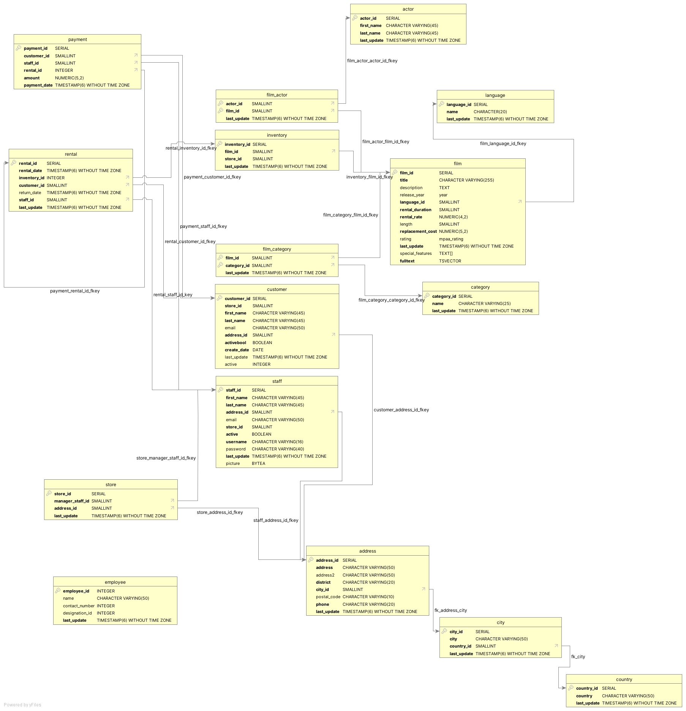

# cf-Rockbuster

This repository contains files with SQL queries for the analysis of data from Rockbuster LLC. Rockbuster Stealth LLC is a movie rental company that used to have stores around the world. Facing stiff competition from streaming services such as Netflix and Amazon Prime, the Rockbuster Stealth management team is planning to use its existing movie licenses to launch an online video rental service i n order to stay competitive.

Objectives
---
First, check and clean selected tables for missing, duplicate and invalid or non-uniform data: '1_cleaning_rockbuster'

The main objective is to generate information for a 3-stage marketing: '2_rockbuster_top_customer_queries'. The campaign first locates the top 10 countries in terms of customer count, then the top 10 cities from within these countries in terms of customer count, and then finds the top 5 customers from these top 10 cities. Descriptive statistics on which genres of film have the longest average rental length are also generated.

Data
---
The database contains the following tables
- actor
- address
- category
- city
- country
- customer
- film
- film_actor
- film_category
- inventory
- language
- staff 
- payment 
- rental

Data is fictional and provided by CareerFoundry GmbH
 
Tools
---
The queries were executed using pgAdmin 4 on a PostgreSQL server.
